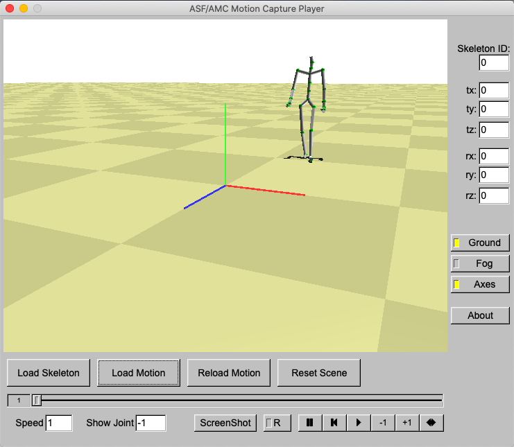

# Mocap Interpolation (OpenGL and C++)
Motion Capture Key Frame Interpolation as part of the USC CSCI 520 in March 2020.


## Features
#### 1) Linear Euler Interpolation
#### 2) Bezier Euler Interpolation
#### 3) SLERP Quaternion Interpolation
#### 4) Bezier SLERP Quaternion Interpolation
#### 5) Graphs for comparison between different methods


## Environment
Implemented in MacOS Catalina.


## Building
#### 1) How to build fltk in Windows, Linux, MAC OS X
On Windows and Linux, please follow the corresponding readme 
files in the folder: fltk-1.3.2
Note: On Linux, you may need to install the "autoconf" tool.

On Max OS X, you should use fltk-1.3.5. Therefore, follow
the instructions in the fltk-1.3.5 folder. Also, you need
to modify two Makefiles:
%homeworkFolder%/mocapPlayer-starter/Makefile
%homeworkFolder%/mocapPlayer-starter/Makefile.FLTK
Open each file in a text editor, and change fltk-1.3.2 to fltk-1.3.5 .

Note: There are many projects in FLTK library. This homework
is only dependent on fltk and fltkgl projects. Students can choose 
to only compile those two projects in the Visual Studio project 
of the FLTK library.

Note: If you want to compile the homework under the release 
configuration, you should first compile the FLTK projects in release. 
Same goes for the debug configuration.

Note: Both the main homework project and FLTK projects work only 
on the Win32 platform. Please do not use other platforms (e.g. X64).

#### 2) How to build starter code in Linux, MAC OS X (Assuming fltk has been compiled)
1) Enter the %homeworkFolder%/mocapPlayer-starter
2) make

#### 3) How to build starter code using Visual Studio 2017 (Assuming fltk has been compiled)
1) Open the project file in homework folder: IDE-starter/VS2017/mocapPlayer.sln
2) Choose Debug/Release mode
3) Compile project: mocapPlayer
4) Compile project: interpolate

Because there are many versions of Windows 10 (different build versions), 
you may get an error when compiling: ... selecting "Retarget solution". 
This can be solved, as the message says, by right-clicking the solution 
and selecting "Retarget solution".


## Usage
#### 1) Go to the mocapPlayer-starter directory

#### 2) Generate a mocap interpolated data:
```
./interpolate ASF_FILE AMC_FILE INTERP_MODE ANGLE_REP N OUT_FILE
```
where
- ASF_FILE :    Choose from [07-walk.asf, 09-run.asf, 131-dance.asf, 135-martialArts.asf]
- AMC_FILE :    Choose from [07_05-walk.amc, 09_06-run.amc, 131_04-dance.amc, 135_06-martialArts.amc]
- INTERP_MODE : Choose from [l, b] where l is linear and b is Bezier
- ANGLE_REP:    Choose from [e, q] where e is Euler and q is quaternion
- N:            Number of skipped frames
- OUT_FILE:     Output file name as a user wishes 

For example:
```
./interpolate 131-dance.asf 131_04-dance.amc b e 10 output.amc
```

#### 3) Open mocap data player:
```
./mocapPlayer
```
- First, click "Load Skeleton" and select an asf file
- Second, click "Load Motion" and select an amc file
- Finally, click "play (triangle shape)" to play the motion capture data
- Lastly, press ESC to exit the program


## User Interface for Mocap Player



## Course Links
1) USC Viterbi School of Engineering [CSCI 520](http://barbic.usc.edu/cs520-s20/)
2) [Assignment 2](http://barbic.usc.edu/cs520-s20/assign2/)

